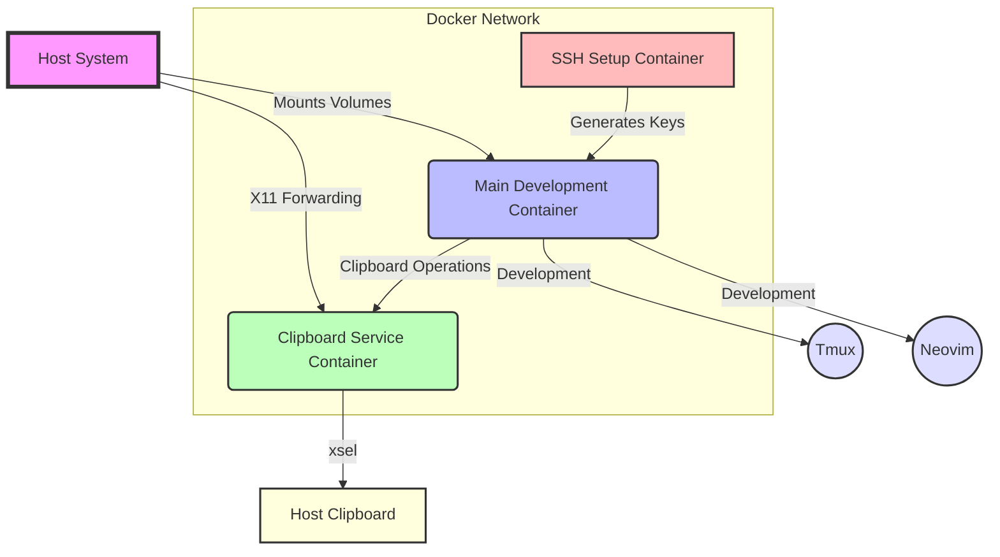

# Architecture Overview

PDP consists of several interconnected components working together to provide a seamless development environment. The following diagram illustrates the high-level architecture:

## Components

1. **Host System**: 
   - The physical or virtual machine running Docker
   - Provides the X11 server for clipboard integration

2. **Main Development Container**: 
   - Primary workspace with tools like tmux and Neovim
   - Mounts local project directory for persistent work
   - Connects to custom clipboard service for seamless copy/paste

3. **Clipboard Service Container**: 
   - Facilitates clipboard sharing between container and host
   - Uses `xsel` for X11 clipboard interaction on Linux hosts
   - Listens for clipboard operations from the main container

4. **SSH Setup Container**: 
   - Generates SSH keys for GitHub authentication
   - Runs once during initial setup
   - Provides keys to the main development container

5. **Docker Network**:
   - Allows communication between containers
   - Isolates the development environment from the host network

## Interaction Flow

1. The user interacts with Tmux and Neovim in the Main Development Container.
2. When copying or pasting, the Main Container communicates with the Clipboard Service.
3. The Clipboard Service uses X11 forwarding to interact with the Host System's clipboard.
4. The SSH Setup Container provides authentication keys to the Main Container for Git operations.

This architecture ensures a consistent development environment with seamless clipboard integration across different host systems, while maintaining security and isolation through Docker networking.
